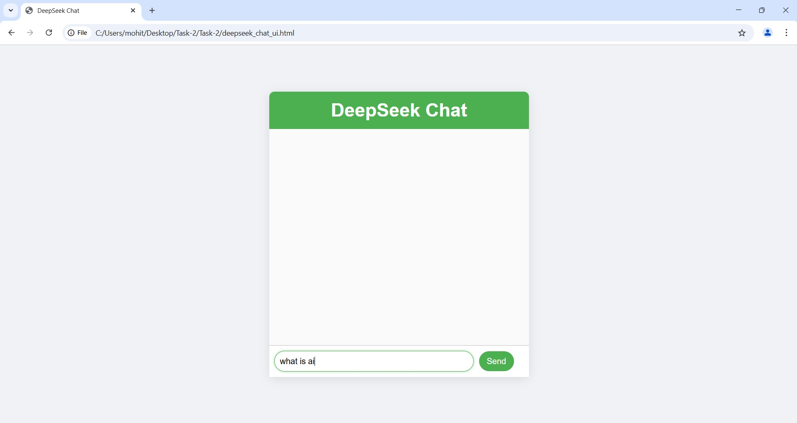

# TASK-2 DeepSeek Chat Integration with Flask

This repository contains a simple web application that integrates with the DeepSeek API to provide a chatbot functionality. It uses Flask for the backend and serves an HTML frontend for the user interface. The chatbot communicates with DeepSeek's AI API to generate responses based on user input.

## Features

- Chat interface for real-time communication.
- DeepSeek API integration to process messages and generate responses.
- CORS support for frontend access.
- Simple styling and user-friendly design.

## Project Structure
├── app.py # Flask server to handle requests ├── deepseek_chat_ui.html # Frontend HTML for chat interface ├── requirements.txt # Python dependencies └── README.md # This file


## Requirements

Before running this project, make sure you have the following installed:

- Python 3.x
- Flask
- Flask-CORS
- Requests library


To install the required Python dependencies, run:

```bash
pip install -r requirements.txt
```

## Setup

### Clone the Repository:

Clone this repository to your local machine:

```bash
git clone https://github.com/MOHITH-TIRUMALASETTY/deepseek-chat.git
cd deepseek-chat
```

##Update API Key:
Open app.py and replace the YOUR_API_KEY placeholder with your actual DeepSeek API key:

```python
DEEPSEEK_API_KEY = "YOUR_API_KEY"
```


## Install Dependencies:
Run the following command to install the required Python packages:

```bash
pip install -r requirements.txt
Start the Flask Server:
To start the Flask server, run:
```

```bash
python app.py
The server will be running at http://127.0.0.1:5000/.
```

## Access the Chat Interface:
Open your browser and navigate to http://127.0.0.1:5000/. You should see the chat interface where you can send messages to the chatbot.

### How it Works
The frontend HTML page (deepseek_chat_ui.html) contains the user interface for chatting with the bot.
The backend Flask app (app.py) listens for POST requests on the /chat endpoint, which receives the user's message, calls the DeepSeek API, and returns a bot response.
The frontend displays both the user's message and the bot's response in the chat interface.
File Descriptions
app.py
This file contains the Flask server code. It handles:

Serving the frontend HTML file.
Handling POST requests to the /chat endpoint.
Communicating with the DeepSeek API using the requests library.
Returning bot responses in JSON format.
deepseek_chat_ui.html
This is the frontend HTML file that provides the chat interface for the user. It includes:

A simple, clean layout with a chatbox.
Input field and send button to send messages.
JavaScript that interacts with the backend and appends messages to the chatbox.

```requirements.txt
This file lists the Python dependencies required to run the Flask app. It includes:
Flask
Flask-CORS
Requests
``` 

## DeepSeek API
This project communicates with the DeepSeek API to generate bot responses. You need to sign up for a DeepSeek API key and use it in the Flask backend (app.py). Replace YOUR_API_KEY with your actual key.

## Screenshots:
 

